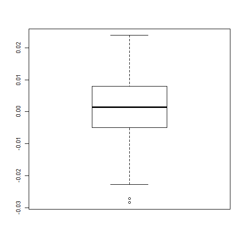
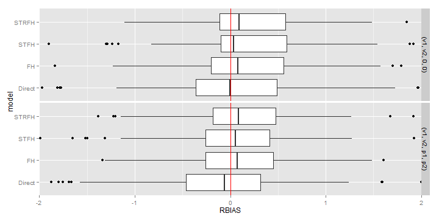
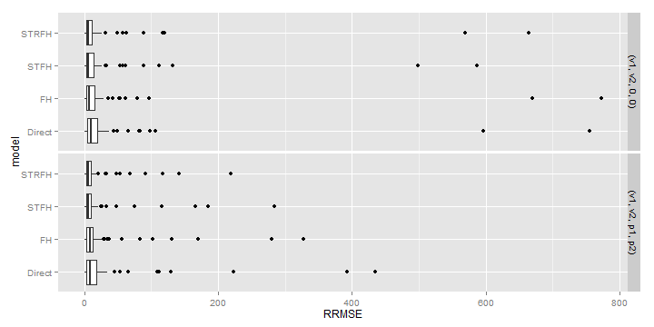
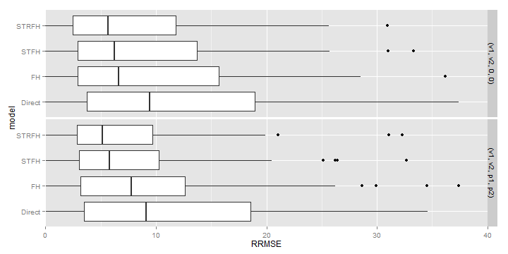

Vorläufige Ergebnisse
========================================================

Es kommen noch einige Änderungen wegen der Generierung der Daten, deshalb sind das sehr Vorläufige Ergebnisse.

Scenario: 
- Regressor kommt aus einer Gleichverteilung zwischen -1 und 1
- RandomEffect nicht kontaminiert kommen aus einem SAR bzw. AR Prozess mit 0 bzw. 0.5 Korrelation und Varianz = 1 bzw. 9 für kontaminierte Daten. 5% der Beobachtungen sind Ausreißer
- 100 Domains - 10 Zeitperioden - 200 Wiederholungen


Etwas erschreckend sind die extremen Werte. Ich hoffe das wird sich noch etwas ändern, wenn ich die Datengenerierung angepasst habe. Das Modell "Direct" sind einfach die Sampling Errors. Für jedes Modell ein Wert pro Area. Für das STFH-Modell habe ich immer wieder das Problem, das nicht für alle Datensätze Ergebnisse vorliegen. bei diesem durchlauf habe ich für den STFH 198 erfolgreiche durchläufe, für 2 gibt es kein Ergebnis...


```r
ggRBIAS <- plotSimResultList(simResults[-c(2, 3)], critFunctionName = "calcRBIAS")
ggRBIAS
```

 


```r
ggRBIAS + coord_flip(ylim = c(-2, 2))
```

 


```r
ggRRMSE <- plotSimResultList(simResults[-c(2, 3)], critFunctionName = "calcRRMSE")
ggRRMSE
```

 

```r
ggRRMSE + coord_flip(ylim = c(0, 40))
```

 


